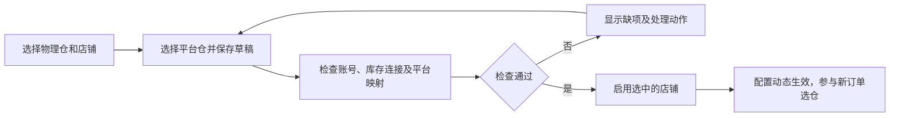

# 四个 ARP 仓库发货实现

状态：休斯顿已实现发货接入；亚特兰大尚未上架，只预留接入口并默认停用。2026-10-07 复核库存、平台映射、物流规则和页面。统一页面管理、按店铺映射、检查、启用与暂停已实现。

页面管理目标：在 XLWMS 仓库管理中完成平台仓库映射、检查、启用和暂停。已有物理仓上架后，运营人员可以通过页面操作，不需要再修改代码、编辑服务环境变量或重启服务。

## 仓库模型

ARP 衣架业务使用四个平级物理仓库；地理区域仅用于可选筛选。

| 展示名称 | 仓号 | OMS 物理编码 | 稳定业务 key | 当前状态 |
| --- | --- | --- | --- | --- |
| ARP-宾夕法尼亚 | 1 | `HYTX30` | `ARP_EAST` | 已接入；城市名称尚未核实 |
| ARP-洛杉矶 | 8 | `ARPCA01` | `ARP_WEST` | 已接入 |
| ARP-休斯顿 | 6 | `ARP06A` | `ARP_HOUSTON` | 库存、选仓、报价及物流校验已接入 |
| ARP-亚特兰大 | 待上架 | `ARPGA` | `ARP_ATLANTA` | 预留元数据及规则，履约默认停用 |

既有 key 和物理编码继续定位历史记录。系统同时保留 DPS 纽约仓和 DPS 加州仓。
前端统一采用 `ARP-地点` 显示名。

## 账号与平台映射

休斯顿复用 ARP 衣架 OpenAPI 凭据及其绑定的 `arp` OMS 账号，不需要新 key。
实际登录核实该账号的可选仓库包含 `ARP06A`。账号由具体 SKU/物理仓的凭据绑定解析，
不通过 ARP/DPS 名称推断；一个账号可绑定多个凭据，一个凭据可覆盖多个仓库。

Temu 的以下两个注册由业务确认属于同一个 ARP-6号仓：

| 店铺 | 平台注册名称 | 实际平台仓 ID |
| --- | --- | --- |
| Panda Homes | ARP-休斯顿6号仓 | `WH-10610323701891516` |
| Panda Buy | ARP-休斯顿仓库 | `WH-10610247352452545` |

统一逻辑映射 `ARP_HOUSTON`，实际报价使用当前店铺的注册 ID。
没有休斯顿注册的店铺不能借用其他店铺的仓库地址。当前 Hans Living、Woven Whispers
未发现休斯顿注册，需要在平台登记后同步。

亚特兰大计划也使用 ARP 衣架账号。当前未上架，OMS 账号的可选仓库和凭据 SKU 库存范围
均未出现该仓；当前工作仅预留，待上架后核实权限、发现库存范围并补实际平台映射。

SHEIN 的物理编码及物流规则已支持休斯顿。平台地址 ID 在 XLWMS 仓库管理中按店铺保存、验证和启用，运行时读取数据库配置，无需编辑环境变量或重载服务。
既有已核实的主店铺映射在首次导入时迁入数据库，之后不覆盖运营设置；历史面单同时保留原物理仓快照。
截至 2026-10-07 尚未配置休斯顿的实际 SHEIN 地址 ID，因此该店铺的休斯顿映射保持待配置。SHEIN 查询可用仓库需要符合独立履约条件的订单；无法查询时显示待验证，
不能把接口条件不足解释为仓库不存在。

## 物流限制

2026-10-09：休斯顿和亚特兰大的 SpeedX 已开通，物理仓允许 **USPS、GOFO、UPS、FEDEX、SPEEDX、CBS**；Temu 默认允许前五家，SHEIN 同时允许 CBS。
YANWEN、SWIFTX、UNIUNI 和未知承运商仍不可用。排列顺序不表示价格优先级。

有效集合为：

`物理仓能力 ∩ 平台允许物流 ∩ SKU/账号启用物流 ∩ 平台实时可用渠道`

合并平台、SKU、账号规则后，最后应用物理仓能力。启用范围外物流的请求直接拒绝；
前端也禁止勾选。Temu 和 SHEIN 自动、手动报价以及买单均使用有效限制。
买单前从可信报价快照重新验证当前规则，旧报价不能绕过限制。

Temu/SHEIN 购面单查询返回实际承运商。XLWMS 分仓审核核验该字段，未知或违规物流阻止审核。
OMS 的 `_AUTO_MATCH_`、`other` 是上传方式，不能作为真实承运商证明。
通用出库创建接口检查物流渠道；受限仓不能直接用上传模式创建或替换面单，须走已购面单分仓流程。

## 数据与接口

- `xlwms_fulfillment_warehouses` 保存稳定 key、物理编码、显示名、供应商、区域、优先级和启用状态。
- `xlwms_warehouse_carrier_capabilities` 保存物理仓白名单。缺少记录时沿用既有平台规则；明确空数组禁用全部物流。
- 四张平台/SKU 政策表通过外键引用履约注册表，解除原先的四仓限制。
- `GET /v1/fulfillment-warehouses` 返回平级元数据及当前启用状态。
- 每个 SKU 决策提供平级 `warehouses`（含库存、可选性、原因、`api_binding`）；同时保留兼容 `regions`。
- 安全线列表返回各物理仓的 `warehouse_available` 快照，包含休斯顿；合计仅统计启用的履约仓及 SKU 的有效账号范围，并应用库存修正。
- 物流政策返回有效 `base_rules.allowed_carrier_codes`、显示名、能力来源和 `warehouse_enabled`。

迁移 `001_init.sql`、`002_fulfillment_warehouses.sql` 与 `003_warehouse_management.sql` 由现有服务启动机制执行。
新增仓库种子幂等，不覆盖运营设置；SHEIN CBS 与两仓 SpeedX 的旧配置由一次性迁移补齐；后续重启保留运营开关。
亚特兰大初始 `enabled=false`，服务重启不会启用它。

## 库存与选仓

每个 SKU 只查询其已发现、已绑定、有效的履约仓范围，忽略 ARP12 等非当前履约仓。
不同凭据共享物理仓时仍保持 SKU 和账号隔离。休斯顿作为独立候选参与自动报价，无需东/西仓有货。
区域只过滤候选，不决定物理仓身份，也不会丢弃第三个可用仓库。

保持总库存安全线和既有账号指定 `warehouse_codes` 范围。例如脏衣篓账号继续只计算
宾夕法尼亚/洛杉矶两仓库存。范围外仓不会影响无关联 SKU；范围内查询失败仍要求人工处理。
库存修正及预占按物理编码和 SKU 计算；修正为零、库存不足、SKU 禁用或缺少账号绑定不能选择。

## 统一页面管理

### 页面入口与仓库总开关

XLWMS 的“仓库管理”提供“发货仓库”区域，展示四个 ARP 仓及既有两个 DPS 仓。
ARP 仓仍为平级物理仓；每行展示仓名、库存与发货账号、已启用平台店铺、允许物流、状态和操作。

| 页面区域 | 展示内容 | 操作 |
| --- | --- | --- |
| 发货仓库列表 | 物理仓名称、启用店铺数、最近检查时间、具体缺项 | 配置、检查、启用发货、暂停发货 |
| 库存与发货账号 | 已发现该仓的 API 凭据组、绑定的 OMS 账号、SKU 范围与同步状态 | 同步数据；必要时跳转既有账号管理完成绑定或二次验证 |
| 平台仓库映射 | 按 Temu/SHEIN、店铺分别展示平台仓名、平台 ID、映射验证及启用状态 | 同步平台仓、选择仓库、保存草稿、检查并启用、暂停该店铺 |
| 允许物流 | 物理仓能力与当前平台/SKU 规则的有效交集 | 跳转现有发货策略页面；休斯顿、亚特兰大不能扩大到 USPS、GOFO、UPS、FEDEX、SPEEDX、CBS 之外 |
| 操作记录 | 操作人、时间、配置前后值、检查结果 | 查询历史配置 |

列表的主要开关表示“允许该仓参与发货”，更新履约注册表的启用状态。
既有 `xlwms_warehouses.is_active` 是库存连接与仓库数据状态，放在数据连接区域并明确命名，
避免两个开关都叫“已启用”。检查发现数据连接暂停时，页面在连接已登记时提供“恢复数据连接”；尚未发现该仓时可以同步已有凭据重新发现，完成后点击“刷新状态”重新检查。

总开关与每个店铺开关分别保存。总开关关闭则停止该仓新增履约；总开关开启后，只有已配置、
已验证并明确启用的店铺能够使用该仓。页面显示“已启用 2 个店铺，1 个店铺待配置”，
不把一个店铺开通解释为全部平台开通。缺少映射的店铺开关始终显示关闭。

### 配置面板与操作步骤

点击“配置”打开仓库侧栏，按“库存与发货账号 / Temu / SHEIN / 物流规则 / 操作记录”组织内容。
平台页签内选择店铺，库存与账号页汇总所有店铺状态。例如 Panda Homes 与 Panda Buy 的休斯顿 ID 分别保存，互不覆盖；
SHEIN 店铺可以在同一仓库侧栏中独立开通。

运营操作流程：

1. 选择目标物理仓，查看已有 API 凭据覆盖和 OMS 账号。发货账号沿用 API 凭据绑定，不新建仓库专属 key，不新增仓库到账号或 SKU 到账号的第二套路由。
2. 选择平台及店铺，点击“同步平台仓库”，从当前店铺实际可用仓中选择目标地址。下拉项同时显示平台仓名和平台 ID。
3. 平台暂时无法列出仓库时，可以填写从平台取得的真实 ID 并保存草稿；草稿不参与报价或购单。SHEIN 可以选择一笔符合独立履约条件的订单进行只读验证。
4. 点击“检查配置”，逐项显示通过、未通过或待验证，以及可执行的处理动作。保存映射或调整账号后，旧检查结果失效。
5. 检查通过后点击“启用此店铺”。物理仓尚未启用时，按钮明确为“启用仓库和此店铺”，在一次事务中写入两个状态。其他店铺保持各自状态。
6. 任意时候可以暂停单个店铺或整个物理仓，配置及历史记录保留，之后可再次检查并启用。

### 状态与启用检查

“待上架、待配置、待验证、可启用、已启用、已暂停”由真实配置和检查结果计算，不按仓库名称硬编码。
亚特兰大上架并完成配置后，页面自然转为可启用，前端已移除固定的“待上架”和 `disabled:true` 分支。

启用检查包括：

- API 凭据有效、同步状态就绪，已发现且可核验该仓的数据范围；OMS 绑定存在且账号有该物理仓权限。
- 库存连接可查询。零库存本身不阻止完成配置；具体订单仍按库存数量、修正、安全线及预占规则决定可选性。尚未核实该仓的数据范围时显示待验证。
- 平台仓属于所选店铺且支持对应发货方式，平台 ID 与物理仓映射已经核实。其他店铺的注册不能作为当前店铺的授权。
- 物理仓与平台有效物流配置非空；休斯顿和亚特兰大以 USPS、GOFO、UPS、FEDEX、SPEEDX、CBS 为上限。实际可报价的物流继续由每笔订单的实时返回决定，不要求所有渠道始终同时可报价。
- 配置版本与检查版本一致。最终启用请求在服务端重新核验，不能只依赖前端按钮状态。

检查只查询权限、仓库、库存及配置，不购买面单、不审批出库。SHEIN 缺少符合条件的订单时，
显示“已保存，需有效订单验证平台仓库”，保留草稿并阻止该店铺启用。

### 数据归属与运行时读取

XLWMS 统一保存物理仓启用状态、平台店铺映射、店铺启用状态和修改历史。
Temu/SHEIN 继续拥有各自的平台凭据、签名、平台仓库发现及购单接口。
XLWMS 通过既有服务调用获取平台仓库列表，不复制平台密钥，不直接代签平台请求。

保留 `xlwms_fulfillment_warehouses` 和现有物理仓物流能力表，保存：

| 数据对象 | 主要内容 |
| --- | --- |
| `xlwms_platform_warehouse_bindings` | `warehouse_key`、`platform`、`shop_code`、`platform_warehouse_id`、平台名称快照、`enabled`、版本、验证时间及验证结果 |
| 仓库配置历史 | 修改人、修改时间、修改前后值、版本，以及启用检查的结果 |

同一个物理仓在同一平台店铺有一个默认发货映射；同店铺的一个平台仓 ID 不能绑定到两个不同物理仓。
两种唯一约束分别为 `(warehouse_key, platform, shop_code)` 和 `(platform, shop_code, platform_warehouse_id)`。
绑定表引用现有物理仓和平台店铺注册；被停用的店铺不能通过仓库配置入口重新获得发货权限。
表中不保存 OMS 密码、平台 token 或 App Secret；OMS 账号与 API 凭据关联继续沿用现有模型。

Temu 与 SHEIN 在报价、购单、自动任务和人工操作中读取当前店铺的映射及启用状态。
普通展示读取可以短时缓存；提交购单前必须获取当前版本的有效配置，读取失败时停止新的购单。
SHEIN 已将启动时的进程全局映射改为按店铺、按请求使用映射快照，避免热更新普通 Go map 及跨店铺混用。
数据库保存后即成为配置来源，无需写 `.env`、修改源码或重启任何服务。

有效的新购单条件为：

`仓库履约总开关 ∧ 库存连接可用 ∧ 当前店铺映射已验证且启用 ∧ 订单库存及 SKU 规则通过 ∧ 实际渠道符合物理仓物流能力`

普通停用阻止新增选仓、报价、购单、库存预占和未购面单的出库创建。已经提交到平台的购单请求可能继续完成，
页面显示处理中数量；已购面单的审核、出库、跟踪继续按购单时的物理仓、平台地址和账号绑定处理。
购单记录保存配置版本与绑定快照，后续暂停或修改映射不能把既有面单解释成另一个仓库。
历史绑定保留，不通过删除或覆盖历史数据改变已购面单去向。

### 管理接口

以下入口已提供；写入、同步平台仓和检查配置均复用管理账号认证。

| 接口 | 用途 |
| --- | --- |
| `GET /v1/fulfillment-warehouses` | 扩展既有读接口，分别返回履约总开关、库存连接状态、各店铺状态及缺项 |
| `PATCH /v1/fulfillment-warehouses/{key}` | 更新物理仓履约总开关与管理信息；不能扩大物理仓物流能力 |
| `GET /v1/fulfillment-warehouses/{key}/platform-bindings` | 查询该仓按平台、店铺保存的映射及版本 |
| `PUT /v1/fulfillment-warehouses/{key}/platform-bindings/{platform}/{shop}` | 保存映射草稿或暂停店铺；首次保存默认停用 |
| `POST /v1/fulfillment-warehouses/{key}/platform-options/query` | 调用对应平台服务列出当前店铺可用仓；SHEIN 可传验证订单上下文 |
| `POST /v1/fulfillment-warehouses/{key}/readiness` | 返回指定店铺的逐项检查结果、配置版本和验证依据 |
| `POST /v1/fulfillment-warehouses/{key}/activation` | 核验版本和就绪状态后，事务性启用物理仓及指定店铺 |
| `GET /v1/fulfillment-warehouses/{key}/history` | 查看修改历史 |
| `GET /v1/fulfillment-warehouses/{key}/activity` | 汇总现有平台服务的处理中购单数量 |
| `GET /v1/fulfillment-warehouse-bindings?platform=...&shop=...` | Temu/SHEIN 读取当前店铺的有效映射与版本 |

复用 XLWMS 已有管理账号认证，写入记录操作人。数据版本校验拒绝过期页面覆盖新配置；
开启请求的服务端校验与状态变更串行处理，防止验证后配置被另一操作者改变。
暂停允许立即生效；`PATCH` 直接写 `enabled=true` 也必须经过与 activation 相同的服务端校验。
映射的 `PUT` 只保存配置或暂停，不直接接受启用。已启用映射发生变更时，该店铺转为待验证并暂停
新增购单，需重新检查及 activation；未改变映射的店铺和历史已购面单不受该配置更新影响。
各接口返回可操作的缺项，例如“该店铺没有此平台仓”“账号尚未授权该仓”“请完成账号验证”。

### 现有配置迁移与实现范围

1. XLWMS 增加配置表、管理接口与页面，迁移保留现有启用状态、API 绑定和物理仓物流限制；亚特兰大仍从停用开始。
2. Temu 按店铺迁移既有映射：Panda Homes/Panda Buy 使用各自已确认的休斯顿 ID；没有注册的店铺保持停用。Temu 的原映射页展示当前有效配置并提供统一管理入口；原写接口返回已迁移，避免旧页面覆盖运营设置。
3. SHEIN 将已核实的历史映射和环境变量映射按实际店铺迁入数据库，不能把全局映射无条件复制给所有店铺。运行时改为读取统一配置；首次部署导入后数据库为唯一管理来源。
4. 仓库列表、选仓、库存安全线及政策页都从元数据获取状态。移除固定亚特兰大待上架文案，在准备就绪后显示真实状态。
5. 更新普通报价、购单、恢复发货、通用出库创建的启用校验；保存并继续使用已购面单的历史绑定快照。

当前实现覆盖已登记的四个 ARP 仓和两个 DPS 仓的配置与开通。新增另一种平台、全新物流能力或
当前字典之外的物理仓涉及注册及适配工作，不把这些情况承诺为单纯切换现有开关。

### 页面方案验收

- 从页面为 SHEIN 休斯顿选择真实平台仓、检查并启用，立即可进入报价和自动选仓；全流程无需编辑文件或重启服务。
- 亚特兰大未上架或无权限时保持待配置/待验证；上架后通过页面同步、映射、检查和启用，前端正常展示其真实状态。
- 单独暂停一个店铺不影响另一店铺；暂停仓库总开关阻止所有店铺新增履约，但已购面单继续按既有绑定处理。
- 未注册店铺、未知平台仓、过期检查结果、错误权限和空有效物流集合不能被启用；零库存不作为配置验证失败。
- YANWEN、SWIFTX 等范围外物流不能通过页面、直接 API 请求或旧报价进入受限仓的购单和审核。
- 修改映射不会改变历史面单仓库；接口读取故障不允许新的购单借用其他店铺或旧全局映射。
- 重复启动保留配置状态，迁移不自动开通亚特兰大、不修改原有账号指定的库存范围；管理操作可追溯。

## 验证与部署

回归覆盖仅休斯顿有货、库存修正、平级候选禁用、账号绑定与预占、低价禁用物流、
策略越权写入、空能力列表、未知物流审核以及亚特兰大默认停用。
安全线快照回归排除待上架仓、非运营仓、其他凭据库存及非正品库存，验证休斯顿计入合计和账号限定仓范围。
PostgreSQL 集成测试在隔离 schema 的事务内验证旧库升级、重复启动及运营配置保留，并回滚全部测试数据。

验证包括 XLWMS `make test`、Temu/SHEIN Go 测试及静态检查，隔离 PostgreSQL schema 中的配置事务与 HTTP 检查、零库存启用、权限拒绝、店铺隔离、版本冲突、重启保留，以及三条前端流程回归（保存/检查/启用/暂停、过期页面、SHEIN 缺验证订单）。生产联调验证只读页面与受影响 API。
XLWMS 使用 `make start`；Temu/SHEIN 重建后重新加载既有 PM2 进程，不另启工作进程。
联调不购买真实测试面单、不审核真实订单。

## 亚特兰大后续接入

当前版本已提供页面开启入口，亚特兰大继续默认停用。
上架后在仓库管理同步现有 API 凭据，发现该仓的数据范围和平台仓，并核实 ARP 衣架 OMS 权限，
补各店铺映射，通过检查后点击启用；使用已预留的四家物流规则和同一套选仓、报价、审核流程。
